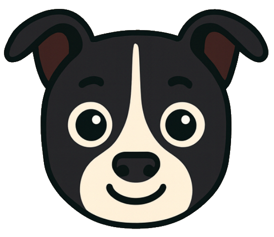
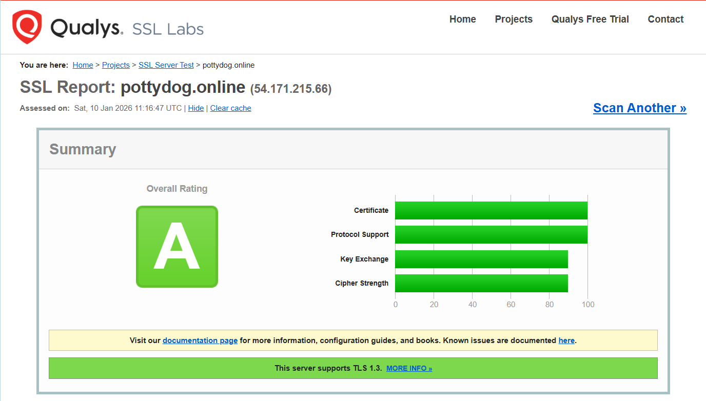
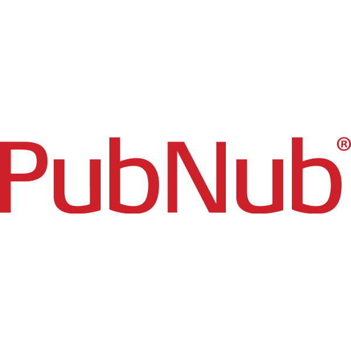
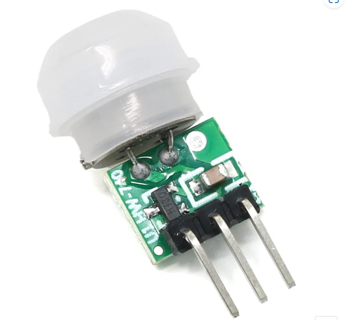
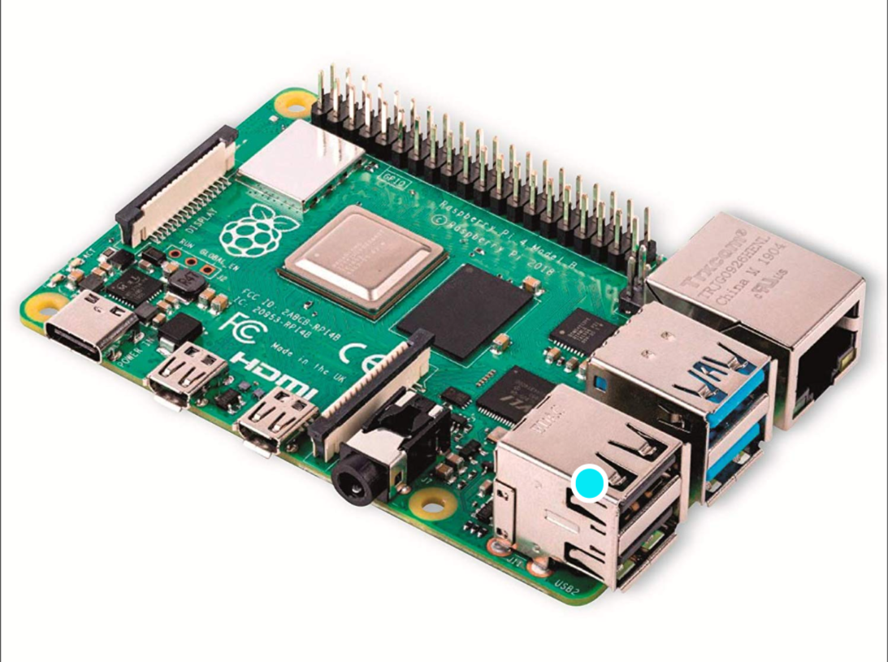
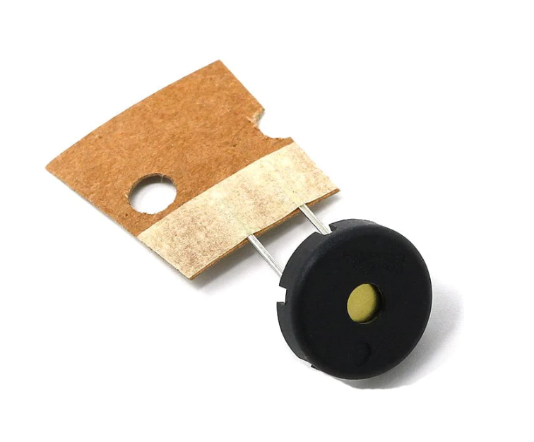
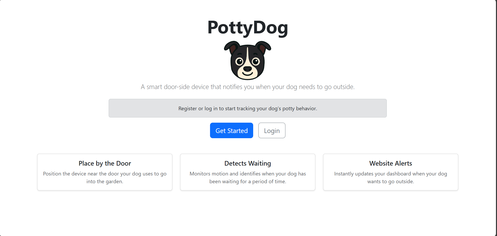
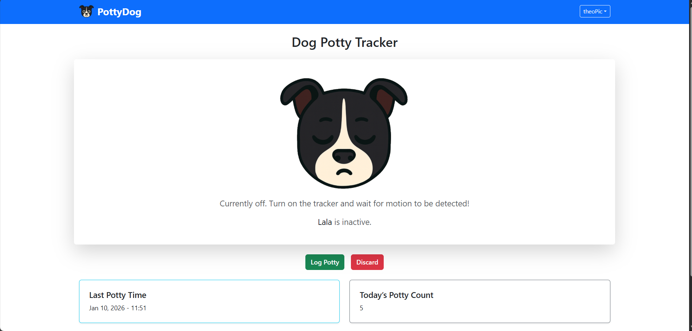
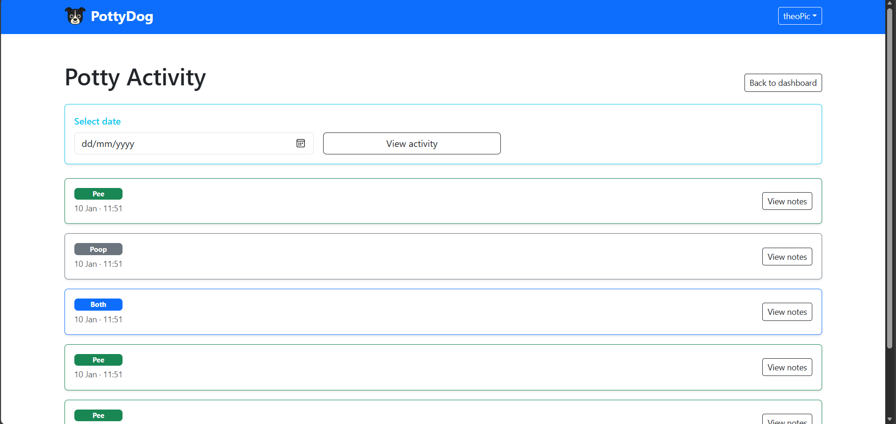
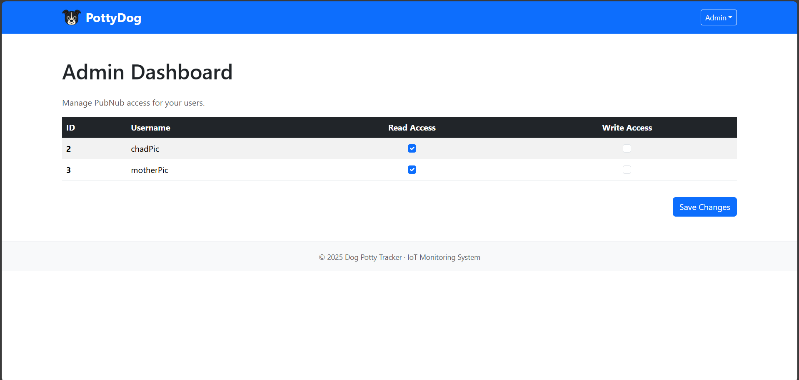

# PottyDog 
## What is PottyDog❔

    

PottyDog is a tool that combines hardware and software that will allow you to know whether or not your dog is waiting by the door to go out and potty, with the help of an easy-to-use UI and easy-to-setup device!

**Note:** new features will still be implemented for this project, but development will slow down.

## Website 🌐

You can check out the website here: https://pottydog.online

**Note:** As this is an early version, you will not be able to track your dog without the device AND the correct permissions. This will be addressed in a future version!

## Technologies Used 🧑‍💻

    
    
    
    
    
    
    
    
    

 

- Languages: Python, JavaScript, HTML, CSS, BootStrap, MySQL DB
- Framework: Flask
- Other: PubNub, Amazon Web Services 

## Hardware Setup 👷
- **PIR Sensor** for motion detection from heat emitting objects, like pets and people

- **Raspberry Pi 400 Model B** for processing sensor input and managing device behaviour

- **Buzzer** as an auditory cue that the device is on and ready to go

- **Fritzing diagram** of hardware connections

## System Architecture 🌉

## Features Implemented ✅
- Live motion detection that updates the UI immediately based on motion type (basic motion, no motion, staying motion)
- Logging in and registering, with passwords securely stored with Bcrypt password hashing
- Logging potty activity (pee, poop, both, other) with the option to add a note to it and view it in a separate page
- Basic profile editing for username and dog's name
- Main dashboard to show motion status, potty activity count for the day, and the last recorded potty activity

## Features to be Implemented 📋
- Google login
- Dynamically add new devices for different dog owners
- Video footage if dog is by the door (may be difficult)
- Edit and delete potty logs in the activity page
- Add and delete users in admin dashboard 
- Allow multiple users to use the same device
- Create a page that gives a tutorial on how to use a device

## Website Preview

